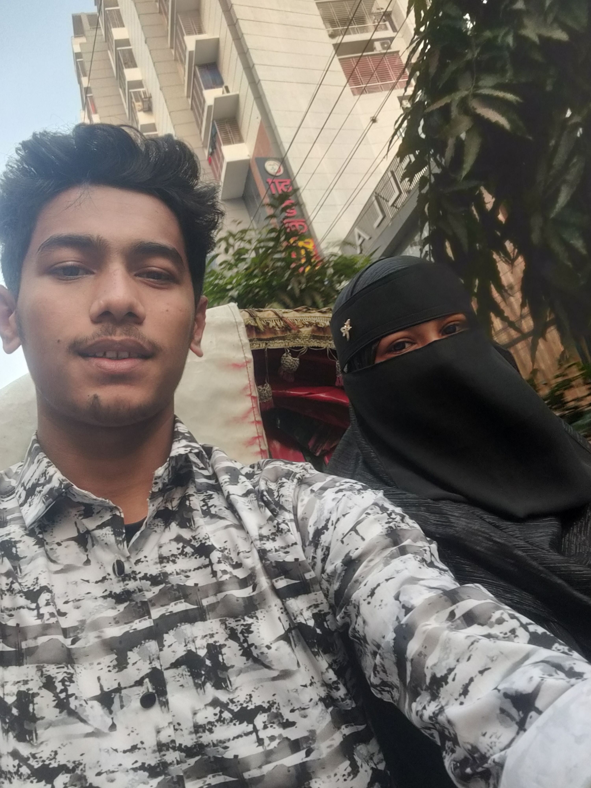
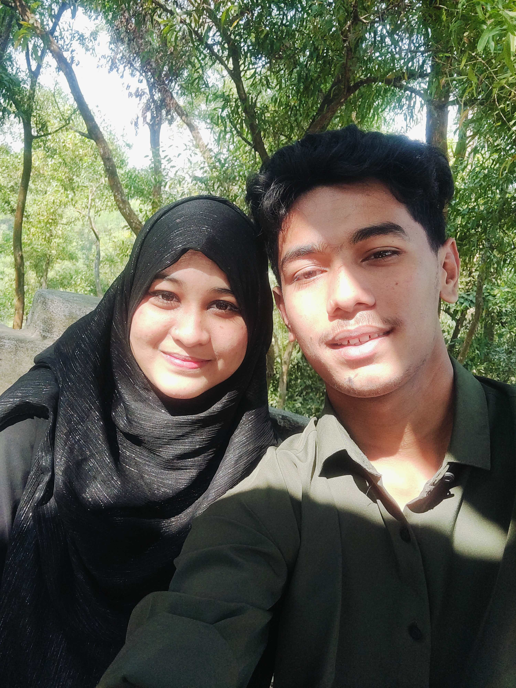
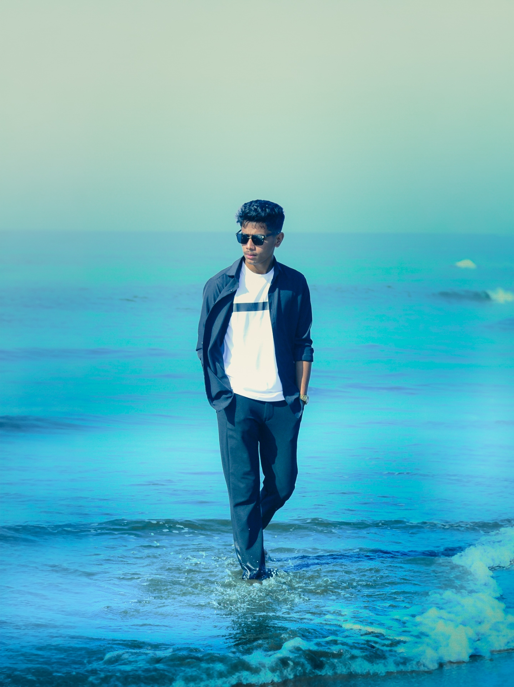

<!DOCTYPE html>
<html>
<head>
<meta name="viewport" content="width=device-width, initial-scale=1.0">
<title>Happy Birthday My Love ❤️</title>

</head>
<body>

<!-- PAGE 1 -->

<h1>🎉 Happy Birthday My Love</h1>

You are the most special person in my life 💕

<button onclick="openModal()">Click for Surprise 💌</button>

🎈

❤️

<!-- MODAL -->

<h3>To My Love ❤️</h3>

 
<button onclick="goPage2()">Next</button>

<!-- PAGE 2 -->

<h2>DO YOU LOVE ME ❤️</h2>
<button onclick="goLove()">YES 💕</button>
<button id="noBtn" onmouseover="moveNo()">NO 😒</button>

<!-- PAGE 3 LOVE -->

<h1 id="loveText" style="font-size:40px;"></h1>
<button onclick="switchPage('pageGift')">Next 💌</button>

<!-- PAGE 4 GIFT -->

<h2>Select One 🎁</h2>
<button onclick="giftWarning()">Gift 🎁</button>
<button onclick="switchPage('pageMemory')">Memory 💖</button>

<!-- PAGE 5 MEMORY LOCK -->

<h2>Tap To Unlock 🔒</h2>

🔒

🔒

🔒

🔒

<!-- PAGE 6 GAME -->

<h2>Pop 5 Balloons 🎈</h2>

0 / 5

<!-- PAGE 7 CONGRATS -->

<h1 style="color:gold;text-shadow:0 0 20px yellow;">CONGRATULATIONS ✨</h1>

রুপা বউ তুমি পেরেছো 💖

<button onclick="switchPage('pageGallery')">See Photos</button>

<!-- PAGE 8 GALLERY -->

<h2>Our Beautiful Memories ❤️</h2>

 

 
<button onclick="showFinalGift()">Open Final Gift 🎁</button>

</body>
</html>
